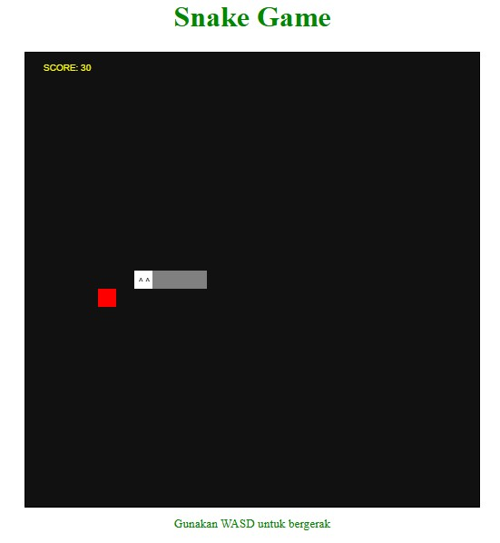
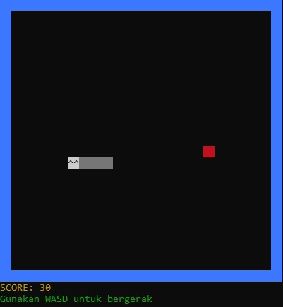

# 🐍 Snake Game

Proyek ini berisi dua versi dari game Snake: versi web dan versi CLI. Game ini memungkinkan Anda untuk mengontrol ular dan mengumpulkan makanan untuk mendapatkan skor.

<p align="center">
  
</p>

## 🌐 Versi Web

Versi web dari game Snake menggunakan HTML, CSS, dan JavaScript. Anda dapat memainkan game ini di browser.

### 🚀 Cara Memulai

1. Clone repositori ini ke komputer Anda.
2. Buka file `snake.html` di browser Anda.
3. Klik tombol "Mainkan" untuk memulai permainan.
4. Gunakan tombol panah atau WASD untuk menggerakkan ular.

### ✨ Fitur

- Tampilan grafis yang sederhana.
- Kontrol menggunakan tombol panah atau WASD.
- Skor ditampilkan di layar.
- Tombol "Main Lagi" untuk memulai ulang permainan setelah game over.

## 🖥️ Versi CLI

Versi CLI dari game Snake menggunakan Node.js dan modul `chalk` untuk tampilan warna di terminal.

### 🚀 Cara Memulai

1. Pastikan Anda memiliki Node.js terinstal di komputer Anda.
2. Clone repositori ini ke komputer Anda.
3. Jalankan perintah berikut untuk menginstal modul `chalk`:
   ```bash
   npm install chalk
   ```
4. Jalankan perintah `node snake-cli.js` untuk memulai permainan.
5. Gunakan tombol WASD untuk menggerakkan ular.



### ✨ Fitur

- Tampilan teks di terminal dengan warna.
- Kontrol menggunakan tombol WASD.
- Skor ditampilkan di terminal.

## 🙏 Keterangan

- Terinspirasi dari permainan Snake klasik project https://github.com/DosX-dev/TinySnake-game
